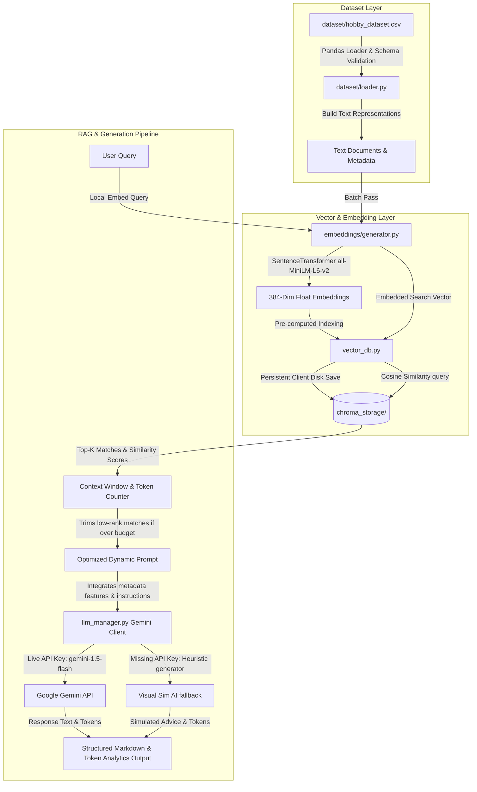

# AI Hobby Intelligence Platform 🎨📸

A production-level, industry-ready **Retrieval-Augmented Generation (RAG)** platform designed to analyze, search, and generate creative recommendations for **Calligraphy** and **Photography** hobbies. 

The system leverages modern NLP architecture, utilizing local transformer embeddings via `SentenceTransformers` (`all-MiniLM-L6-v2`), high-performance local vector similarity indexing with `ChromaDB`, and dynamic prompt-context window optimization integrated with the state-of-the-art **Google Gemini 1.5 Flash** LLM.


---

## 🏗️ System Architecture & Workflow

The platform decouples data processing, local semantic vector mapping, search indices, and generative synthesis into a highly optimized, modular Python pipeline:



---

## 🛠️ Core AI Concepts Explained

### 1. Retrieval-Augmented Generation (RAG)
Large Language Models (LLMs) are highly capable but suffer from knowledge cutoff dates and hallucinatory outputs. RAG resolves this by *retrieving* factual, highly relevant records from a private knowledge source (our CSV database) and *augmenting* the prompt context with this data before sending it to the LLM for *generation*. This ensures the LLM's response is mathematically grounded in facts.

### 2. Dense Vector Embeddings
An embedding is a mapping of words, sentences, or documents into a high-dimensional vector space. In this project, `all-MiniLM-L6-v2` embeds structured descriptions into **384-dimensional dense vectors** of floats. In this space, texts with similar semantic meanings (e.g. "Milky Way star skies" and "deep galaxy astrophotography") sit extremely close to each other, even if they share zero overlapping keywords.

### 3. ChromaDB Vector Database
ChromaDB is an AI-native vector database designed to index and store millions of high-dimensional embeddings. It is configured here to run as a persistent disk instance in `chroma_storage/` using **Cosine Similarity** (`hnsw:space: cosine`). Cosine similarity calculates the angular difference between vectors to retrieve relevant information in microseconds.

### 4. Tokens & Tokenization
LLMs do not read text in words or characters; they process pieces of characters called **tokens**. Typically, 1 token is roughly equivalent to 4 characters or 0.75 words. Tracking tokens is vital to manage costs and ensure performance.

### 5. Context Window Optimization
An LLM's memory is bounded by its "Context Window". While modern models have massive limits, sending massive prompts results in high latencies, higher billing costs, and dilution of focus (the "lost in the middle" effect). Our platform contains an explicit **Context Window Optimizer** that monitors prompt token usage and dynamically drops lowest-ranking matches if the token budget is exceeded.

---

## 📂 Project Structure

```
AI_Hobby_Intelligence_Platform/
│
├── dataset/
│   ├── loader.py            # Generates/loads CSV & constructs text documents
│   └── hobby_dataset.csv    # 25-record custom visual features dataset (Generated)
│
├── embeddings/
│   └── generator.py         # Loads 'all-MiniLM-L6-v2' & creates 384-D vectors
│
├── chroma_storage/          # Persistent local database storage files (Generated)
│
├── main.py                  # Beautiful interactive Rich-based CLI application
├── requirements.txt         # Project package dependencies
├── llm_manager.py           # Gemini SDK interface, context optimizer & token tracker
├── vector_db.py             # ChromaDB client connector, upserts & semantic search
└── README.md                # System user manual & technical documentation
```

---

## 🚀 Setup & Execution Guide

### Prerequisites
* Python 3.8 to 3.14 installed on your system.
* A terminal shell (PowerShell on Windows, Bash on macOS/Linux).

### Step 1: Install Dependencies
Open your terminal in the project workspace directory and run:
```bash
pip install -r requirements.txt
```
*Note: This will download standard packages such as Pandas, Sentence-Transformers, ChromaDB, Google Generative AI, and Rich.*

### Step 2: Configure API Key (Optional)
To run with live AI synthesis, obtain a free API key from [Google AI Studio](https://aistudio.google.com/). You can set it in your terminal environment, create a `.env` file in the root, or **simply paste it when prompted by the CLI on startup**:
```bash
# Optional manual setup
echo GEMINI_API_KEY=your_actual_key_here > .env
```
*If skipped, the system automatically falls back to a clever heuristic Simulated AI Mode, keeping the CLI completely functional and interactive!*

### Step 3: Run the Platform
Start the program with:
```bash
python main.py
```

On first startup, the console will run a fast diagnostics check:
1. It creates the `dataset/hobby_dataset.csv` if missing.
2. It initializes the `all-MiniLM-L6-v2` transformer (downloading weights on the first run, ~120MB).
3. It encodes all 25 records and saves them in the persistent local vector database.
4. It sets up the Gemini LLM client.

---

## 💡 Creative Sample Queries to Try

Once inside the interactive CLI (Option 3 or Option 2), test the semantic depth of the database with these conceptual queries:

### For Photography Focus:
* `candid neon streets at night time`
  *(Retrieves Tokyo street rain photography, displaying cyberpunk aesthetics, cyan/magenta palettes, and high contrast reflections)*
* `galaxy and mountain trees in dark skies`
  *(Retrieves astrophotography records, focusing on Milky Way long exposures and star details)*
* `extreme close-up refraction details`
  *(Retrieves macro photography of water droplets and peacock feathers)*
* `fast action wild animals running`
  *(Retrieves cheetah action captures freezing movement at 1/2000s)*

### For Calligraphy Focus:
* `gothic metal nib script with gold leaf decoration`
  *(Retrieves Gothic Fraktur and Medieval Illuminated lettering with black iron gall inks)*
* `elegant wedding invitation handwriting cursive`
  *(Retrieves Copperplate Script and Spencerian penmanship with flowing hairlines)*
* `minimalist zen stroke with black sumi ink`
  *(Retrieves Shodo Eastern brushwork representing ensō circles)*
* `urban spray paint blackletter wall art`
  *(Retrieves Calligraffiti street art murals blending neon and bold strokes)*

---

## 🛠️ Error Handling & Robustness

The system is engineered with high-level defensive coding parameters:
1. **Dynamic Dataset Recovery**: If `hobby_dataset.csv` is accidentally deleted, corrupted, or misses required columns, the system catches the error, rebuilds the folder structures, and re-writes the 25 records from scratch.
2. **Dynamic Vector Rebuilding**: If the ChromaDB database files in `chroma_storage/` are deleted or cleared, the platform detects an empty collection, triggers the SentenceTransformer encoder, and builds a fresh, correct index.
3. **No-Key Graceful Fallback**: If the Google Gemini API key is missing or invalid, or if you are offline, the program activates the `is_simulated` mode, bypassing network exceptions to yield highly structured visual advice programmatically.
4. **Context Window Protection**: Prevents token overflow issues by checking the token weights of all context documents and safely pruning them before executing API requests.

---

## 🔮 Future Architectural Enhancements

If deploying this platform to an enterprise level, the following expansions are recommended:
* **Hybrid Search Indexing**: Merge vector search with standard BM25 keyword indexes to retrieve precise alphanumeric strings (such as specific camera model numbers or exact nib millimeters) alongside conceptual semantics.
* **Multi-Modal CLIP Ingestion**: Index raw image pixels using a CLIP model. This allows users to search the database using an uploaded photograph or request a structural critique of their hand-drawn calligraphy.
* **Agentic Re-ranking**: Use a two-stage retrieval pipeline where ChromaDB returns the top-15 matches, and a lightweight local reranker model (such as Cohere Rerank or a cross-encoder) narrows it down to the top-3 to maximize relevance.
* **Web UI Dashboard**: Transition the beautiful terminal rich panels into a full glassmorphic Next.js or React dashboard with interactive charts and side-by-side RAG evaluations.
